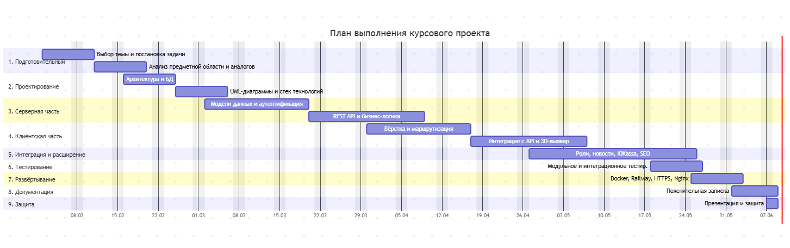

Этап 1. Подготовительный (2 февраля — 15 февраля, 2 недели)
1.1. Выбор и утверждение темы курсового проекта.
1.2. Формулировка цели, задач и границ проекта.
1.3. Изучение предметной области: алгоритмы фотограмметрии и 3D-реконструкции.
1.4. Сравнительный анализ существующих аналогов (Sketchfab, Meshroom, RealityCapture).
1.5. Составление и утверждение графика выполнения работы.
Результат: утверждённое ТЗ, список аналогов, календарный план.
Этап 2. Проектирование (16 февраля — 1 марта, 2 недели)
2.1. Разработка архитектуры системы (клиент-сервер, REST API).
2.2. Проектирование структуры базы данных (сущности: users, projects, jobs, logs).
2.3. Построение UML-диаграмм (Use Case, Class, Sequence, Activity).
2.4. Выбор технологического стека (FastAPI, React, Three.js, PostgreSQL, Docker).
2.5. Проектирование пользовательского интерфейса (wireframes, прототипы).
Результат: диаграммы UML, схема БД, описание архитектуры.
Этап 3. Разработка серверной части (2 марта — 29 марта, 4 недели)
3.1. Настройка окружения разработки, инициализация Git-репозитория.
3.2. Реализация моделей данных и схемы БД (SQLAlchemy/psycopg2).
3.3. Разработка модуля аутентификации и авторизации (JWT, роли STUDENT/STAROSTA/ADMIN).
3.4. Реализация REST API: регистрация, вход, управление профилем.
3.5. Разработка API загрузки архивов и управления проектами.
3.6. Реализация системы уведомлений (email-логи, статусы обработки).
3.7. Написание unit-тестов для бэкенда (pytest, покрытие ≥ 80%).
Результат: работающий бэкенд, Swagger-документация, тесты.
Этап 4. Разработка клиентской части (30 марта — 26 апреля, 4 недели)
4.1. Инициализация React-приложения (Vite + React Router).
4.2. Вёрстка и стилизация страниц (Login, Home, Library, Profile).
4.3. Реализация контекста авторизации и защищённых маршрутов.
4.4. Интеграция с бэкендом через Axios (запросы, обработка ошибок).
4.5. Разработка страницы загрузки архивов с отображением статусов.
4.6. Реализация 3D-вьювера на Three.js (React Three Fiber).
4.7. Анимация и интерактивное управление камерой.
Результат: работающий фронтенд, 3D-визуализация, интеграция с API.
Этап 5. Интеграция и расширение функционала (27 апреля — 17 мая, 3 недели)
5.1. Настройка CORS и обработка cross-origin запросов.
5.2. Реализация ролевой модели (разграничение доступа).
5.3. Разработка модуля новостей и административной панели.
5.4. Интеграция платёжной системы (ЮKassa, тестовый режим).
5.5. Добавление SEO-элементов (robots.txt, sitemap.xml, мета-теги, OG-теги).
5.6. Оптимизация производительности (ленивая загрузка, кэширование).
Результат: полнофункциональное приложение с ролями и платежами.
Этап 6. Тестирование и отладка (18 мая — 24 мая, 1 неделя)
6.1. Модульное тестирование серверной части (итоговое покрытие).
6.2. Интеграционное тестирование (E2E сценарии).
6.3. Тестирование безопасности (SQL-инъекции, XSS, CSRF).
6.4. Кроссбраузерное тестирование.
6.5. Исправление выявленных ошибок.
Результат: стабильная версия приложения, отчёт о тестировании.
Этап 7. Развёртывание (25 мая — 31 мая, 1 неделя)
7.1. Контейнеризация приложения (Docker, Docker Compose).
7.2. Развёртывание на PaaS-платформе (Railway).
7.3. Настройка HTTPS (автоматические сертификаты Let's Encrypt).
7.4. Настройка reverse proxy (Nginx).
7.5. Проверка работы в production-режиме.
7.6. Анализ производительности (Google PageSpeed Insights, Web Vitals).
Результат: работающий сайт в интернете, метрики производительности.
Этап 8. Оформление документации (1 июня — 6 июня, 1 неделя)
8.1. Написание пояснительной записки (введение, теория, проектирование).
8.2. Описание реализации (архитектура, код, скриншоты).
8.3. Описание развёртывания и тестирования.
8.4. Формирование списка использованных источников.
8.5. Подготовка приложений (руководство пользователя, код).
8.6. Нормоконтроль и вычитка.
Результат: готовая пояснительная записка (48+ страниц).
Этап 9. Защита проекта (7 июня — 8 июня, 2 дня)
9.1. Подготовка презентации (10–12 слайдов).
9.2. Подготовка демонстрационного сценария.
9.3. Репетиция доклада.
9.4. Защита курсового проекта.
